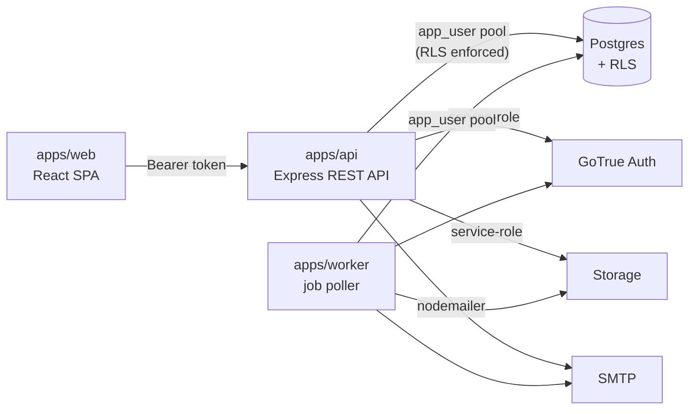

# IntroBuddy — Technical Documentation

Technical documentation for **IntroBuddy**, a multi-tenant B2B SaaS where
colleges onboard their students to connect them with verified alumni. This
set covers **Phase 1** (college onboarding, bulk student import, student
self-service, administration) as implemented in the current codebase. The
alumni module itself is Phase 2.

> **Accuracy contract.** Everything here is transcribed from the code and the
> `supabase/migrations/*.sql` files, not from a spec or from memory. When code
> and docs ever disagree, the code is right — update the doc.

## Map

| Document | What's in it |
|---|---|
| **[architecture.md](architecture.md)** | System architecture: frontend, backend, DB, worker, auth, multi-tenancy, storage; request & session lifecycles; topology and component diagrams. |
| **[database.md](database.md)** | Full database reference: every table (purpose, columns, constraints, FKs, indexes, relationships, RLS, usage, example), the ER diagram, and all SQL / `SECURITY DEFINER` functions. |
| **[workflows.md](workflows.md)** | Step-by-step workflows with Mermaid sequence diagrams for Super Admin, College Admin, Student, the Background Worker, and both dashboards. |
| **[security.md](security.md)** | Security model: multi-tenancy, RLS, `SECURITY DEFINER` functions, password/identity, HIBP, rate limiting, sessions, audit logging, and the authorization/permission matrix. |
| **[production-readiness-plan.md](production-readiness-plan.md)** | Production deployment plan: hosting, database, auth, email, storage, DNS/CDN/SSL, monitoring, logging, analytics, error tracking, background jobs, backups, security, rate limiting, secrets, CI/CD, compliance, cost estimates (MVP vs. scale), and the exact-order deployment checklist. |
| **[adr/](adr/README.md)** | Architecture Decision Records — the index plus per-ADR summaries (decision, why, alternatives, why chosen), each linking to the full record. |

## The system in one screen



- **Monorepo** (npm workspaces): `apps/{web,api,worker}`,
  `packages/{db,shared,import,invitations,jobs}`.
- **One shared Postgres**; every tenant-scoped table enforces
  `FORCE ROW LEVEL SECURITY`. The API connects as a non-owner role
  (`app_user`) so RLS applies. See [security.md](security.md).
- **The browser never touches Postgres/Auth/Storage directly** — Supabase is
  managed infrastructure behind our own API.

## Roles at a glance

| Role | Anchored to | Can, broadly |
|---|---|---|
| **super_admin** | sentinel `platform` tenant | create colleges, resend admin invites, view the platform dashboard & audit log |
| **college_admin** | their college's tenant | college profile & taxonomy, import/invite/manage students, dashboard, audit log |
| **student** | their college's tenant | own profile, résumé, certifications; trigger own password reset |

Authorization is a data-driven permission matrix (not role-string checks) —
the full table is in [security.md](security.md#permission-matrix-current).

## Running it locally

Prerequisites: Docker (for Supabase) and Node. From the repo root:

```bash
npm install
npm run db:start                       # Supabase stack (Postgres, GoTrue, Storage, Mailpit)
npm run dev --workspace=@introbuddy/api      # API on http://127.0.0.1:3001
npm run dev --workspace=@introbuddy/worker   # background job worker
npm run dev --workspace=@introbuddy/web      # SPA on http://127.0.0.1:3000
```

- App: `http://127.0.0.1:3000` · API: `http://127.0.0.1:3001` ·
  Mailpit (captured email): `http://127.0.0.1:54324`.
- The first super_admin is seeded by `apps/api/src/scripts/bootstrapSuperAdmin.ts`
  (no HTTP route — ops/seed only).
- Emails go to Mailpit locally, never a real inbox.

## Conventions

- **Migrations are the schema's source of truth** (`supabase/migrations/`).
  Every tenant-scoped table repeats the same RLS pattern — no table gets a
  silent exception.
- **Decisions live in ADRs.** A hard-to-reverse choice gets a record; a change
  of mind gets a *new* ADR that supersedes the old, never an edit to history.
- **Tests are part of the contract:** the tenant-isolation test
  (`packages/db`) runs in CI on every push and must never be removed.
