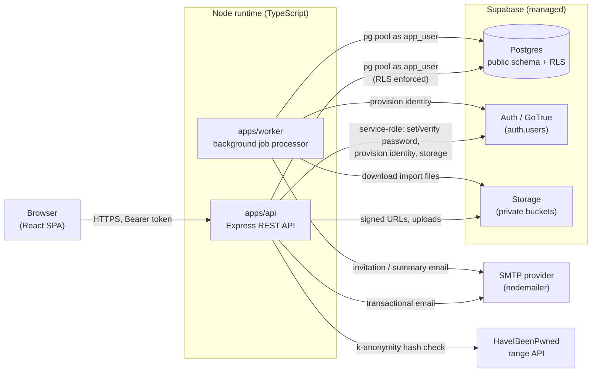
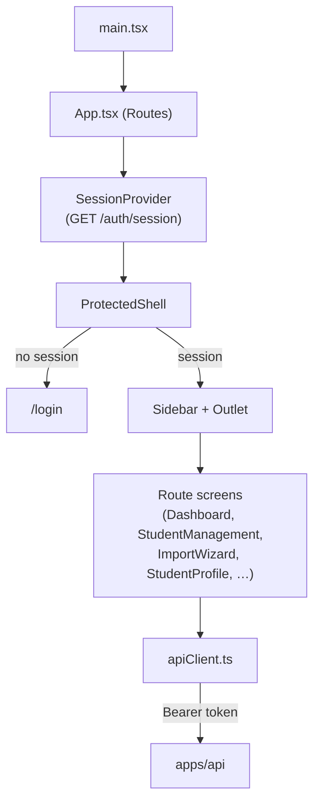
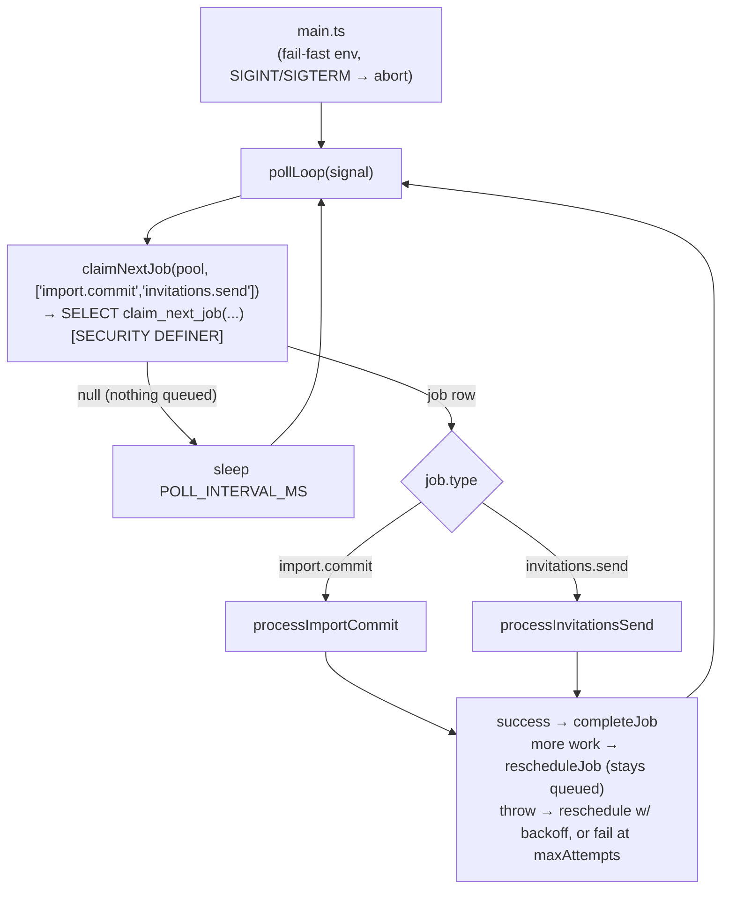
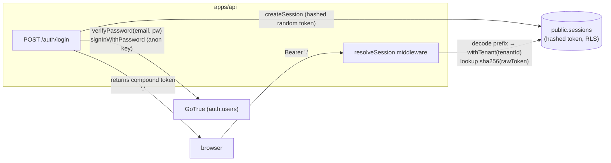
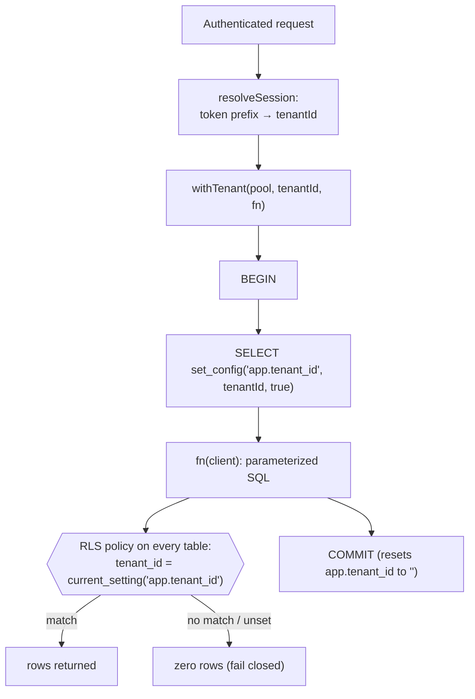
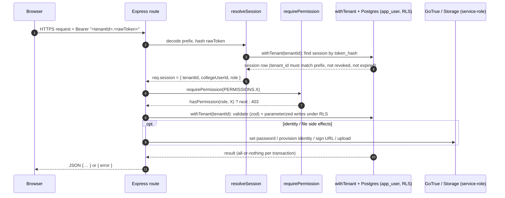
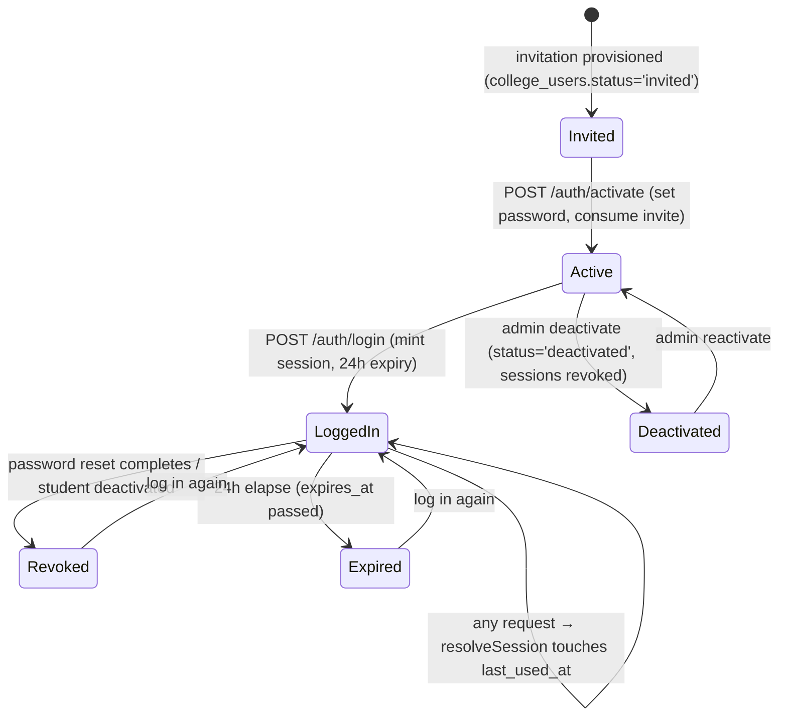

# System Architecture

> Reflects the codebase as of the end of Phase 1. Every claim here traces to
> a specific file/migration; when in doubt, the code is the source of truth.

IntroBuddy is a multi-tenant B2B SaaS: colleges (tenants) onboard their
students so they can later connect with verified alumni. Phase 1 delivers
college self-onboarding, bulk student import, the student self-service
profile, and administration. (The alumni module itself is Phase 2.)

## 1. High-level topology

**Key boundary:** the browser never talks to Postgres, GoTrue, or Storage
directly. Supabase is used as *managed infrastructure behind our own API*,
not as a backend-as-a-service. Every data access goes through `apps/api`,
which connects to Postgres as a **dedicated non-owner role (`app_user`)**
under which Row-Level Security is enforced.

## 2. Monorepo layout

npm workspaces (`apps/*`, `packages/*`). Apps are deployables; packages are
shared libraries with no app of their own.

| Workspace | Kind | Responsibility |
|---|---|---|
| `apps/web` | Deployable (static SPA) | React UI, one build served from a static host/CDN |
| `apps/api` | Deployable (Node service) | The REST API; the only thing that touches the DB/Auth/Storage |
| `apps/worker` | Deployable (Node process) | Polls the Postgres job queue; runs bulk-import commit and invitation sending |
| `packages/db` | Library | `getPool()` and `withTenant()` — the tenant-scoping transaction wrapper |
| `packages/shared` | Library | Roles, the permission matrix, and all zod request schemas (shared by API + web) |
| `packages/import` | Library | Pure CSV/XLSX parsing, column-mapping guessing, and row validation (no I/O) |
| `packages/invitations` | Library | Compound tokens, identity provisioning, invitation/collegeUser DB helpers, email templates |
| `packages/jobs` | Library | The job queue, import-job persistence, import storage — shared by API + worker |

## 3. Frontend architecture (`apps/web`)

- **Stack:** Vite + React 18 + TypeScript, single-page application. Tailwind
  CSS v3 with hand-written shadcn/ui-style primitives
  (`src/components/ui/*`). Routing via `react-router-dom`.
- **Dev server** is pinned to `127.0.0.1:3000` (`vite.config.ts`) so emailed
  activation/reset links (which embed `WEB_APP_URL`) resolve locally, and it
  proxies the API's real route prefixes to `127.0.0.1:3001` unchanged (no
  `/api` rewrite) so dev and production request paths are identical.
- **API client** (`src/lib/apiClient.ts`): a thin `fetch` wrapper that
  attaches `Authorization: Bearer <token>` from web storage, parses JSON,
  and normalizes the `{ error }` shape every route returns into a typed
  `ApiError`. Multipart variants never set `Content-Type` manually.
- **Session** (`src/context/SessionProvider.tsx` + `sessionContext.ts`): on
  load and after login, calls `GET /auth/session` to resolve
  `{ role, tenant, identity }`. Exposes `can(permission)` which reuses the
  **exact same `hasPermission`** from `@introbuddy/shared` the backend uses —
  the frontend never reimplements authorization, it only mirrors it for UX.
  The opaque bearer token is stored in `localStorage` (remember-me on) or
  `sessionStorage` (remember-me off).
- **Shell** (`src/components/AppShell.tsx`): a `ProtectedShell` redirects to
  `/login` without a session; authenticated users get a persistent, fixed
  left **sidebar** (`Sidebar.tsx`) whose items are permission-gated from a
  single `NAV_ACTIONS` source of truth (`src/lib/navigation.ts`). `/` is a
  role-based redirect: super_admin → `/admin/dashboard`, college_admin →
  `/college/dashboard`, student → `/profile`.

## 4. Backend architecture (`apps/api`)

Express app (`src/app.ts`) mounting one router per resource:

| Prefix | Router | Notes |
|---|---|---|
| `/health` | health | Liveness only |
| `/auth` | auth | login, activate, reset request/complete, `GET /session` |
| `/invitations` | invitations | single-person invite (college_admin / super_admin) |
| `/colleges` | colleges | `POST /` create college; `GET /` platform list; profile; reinvite |
| `/degrees`, `/departments` | degrees/departments | taxonomy CRUD |
| `/import-jobs` | importJobs | the six-phase bulk-import workflow |
| `/me` | me | student self-service profile + certifications |
| `/students` | students | admin student search/edit/deactivate/reset |
| `/dashboard` | dashboard | per-college student stats |
| `/audit-log` | auditLog | read side of the audit log |

**Layering:** `route → middleware (resolveSession, requirePermission) →
withTenant(pool, tenantId, fn) → db helper (parameterized SQL)`. Route
handlers never build a pg connection or set a tenant themselves; they call
`withTenant`, and everything inside runs under RLS scoped to that tenant.

**Two connection identities to Postgres, deliberately:**
- **`app_user`** (a non-owner role) via the `pg` pool for all business data —
  RLS applies to it. This is `packages/db`'s `getPool()`.
- **Supabase service-role / anon clients** (`src/lib/supabaseAuth.ts`) used
  *only* for GoTrue (set/verify password, provision identity) and Storage —
  **never** to query `public` tables. Keeping these separate is what makes
  the RLS guarantee real (see [security.md](security.md)).

## 5. Database architecture

- One shared Postgres database; every tenant-scoped table has a `tenant_id`
  column and an identical `FORCE ROW LEVEL SECURITY` policy
  (`tenant_id = nullif(current_setting('app.tenant_id', true), '')::uuid`).
- The app sets `app.tenant_id` per-transaction via
  `SELECT set_config('app.tenant_id', $1, true)` inside `withTenant()` —
  never a session-level `SET` (which would leak across pooled connections).
- Two tables are deliberately *not* tenant-scoped: `tenants` (it *is* the
  tenant) and `rate_limit_hits` (operational bookkeeping). Neither has RLS.
- Three `SECURITY DEFINER` functions punch narrow, named holes through RLS
  for genuinely cross-tenant needs: `find_auth_user_id_by_email`,
  `claim_next_job`, `get_student_counts_by_tenant`.
- Full schema, per-table docs, ERD, and functions: **[database.md](database.md)**.

## 6. Worker architecture (`apps/worker`)

A single Node process that polls the Postgres `jobs` table — no Redis, no
cron, no external queue (same reasoning as ADR 0004 for rate limiting).

Design properties (all in `pollLoop.ts` / `jobs/*.ts`):

- **Claiming is cross-tenant by nature** — before a job is claimed there is
  no single tenant to scope to — so it uses the `claim_next_job`
  `SECURITY DEFINER` function (`FOR UPDATE SKIP LOCKED`, one row). *Every
  subsequent write* the worker makes goes through the ordinary
  `withTenant()` path, identical to the API.
- **Never sleeps in-process for real work.** A job with more to do calls
  `rescheduleJob` (sets itself back to `queued` with a new `run_after` /
  updated `payload.offset`) instead of looping. A restart mid-batch loses at
  most one in-flight chunk and resumes from the persisted offset.
- **Retries** use exponential backoff (`30s · 2^(attempts-1)`, capped 5 min)
  up to `max_attempts` (default 5), then the job is marked `failed`.
- **Import commit** re-validates the whole file each execution (reference
  data may have changed) and writes one bounded chunk of rows per execution.
- **Invitation send** mints + emails one chunk per execution, self-spacing to
  `INVITATION_SEND_RATE_PER_HOUR`, terminating when no pending candidates
  remain. Mint + send happen in one transaction so "has a live invitation"
  stays exactly equal to "the email was actually sent."

## 7. Authentication architecture

GoTrue (Supabase Auth) is the **password/identity backend only**; the API
mints its **own** first-party session token (ADR 0002). GoTrue never issues
the browser a token.

- **Compound token** = `"<tenantId>.<rawToken>"`. The tenant prefix is an
  *untrusted routing hint* — it only picks which RLS partition to query. Only
  the SHA-256 of the random half, matched in `sessions`, proves anything, and
  the row's real `tenant_id` must equal the prefix (`resolveSession.ts`).
- **Passwords** are never stored by us: `setPassword` (service-role
  `updateUserById`) writes to GoTrue; `verifyPassword` (anon
  `signInWithPassword`) checks against it.
- Activation and password-reset links use the **same compound-token design**
  (`invitations` / `password_resets` tables), because they hit the identical
  "can't query before tenant is known" RLS problem.

Full request and session lifecycles are in §10–11 below; the auth flows
(login/activate/reset) are diagrammed in **[workflows.md](workflows.md)**.

## 8. Multi-tenant architecture

- Isolation is a **property of the database**, not of every developer
  remembering a `WHERE tenant_id = …`. A forgotten filter returns zero rows,
  never another tenant's rows.
- `super_admin` is anchored to a sentinel `platform` tenant (slug `platform`)
  so the exact same session/RLS machinery works for it unchanged (ADR 0007).
  Cross-tenant power is a *permission* (`college.viewAll`, `college.create`),
  never a session-shape special case.
- A single isolation test (`packages/db`) creates two tenants and asserts one
  can never read the other; it runs in CI on every push and must never be
  removed.

## 9. Storage architecture

Supabase Storage, three **private** buckets (`supabase/config.toml`); the API
holds paths in Postgres and signs short-lived URLs fresh on every read — URLs
are never persisted.

| Bucket | Used for | Limit / MIME |
|---|---|---|
| `college-media` | College logo & banner (`tenants.logo_path`/`banner_path`) | 10 MiB, `image/jpeg` |
| `student-media` | Student avatar & résumé (`student_profiles.avatar_path`/`resume_path`) | 10 MiB, `image/jpeg` + `application/pdf` |
| `college-imports` | Raw uploaded CSV/XLSX import files (`import_jobs.file_path`) | 20 MiB, CSV/XLSX |

- Images are **EXIF-stripped and normalized** with `sharp` before upload
  (`lib/imageProcessing.ts`) — metadata/geotags never persist.
- Résumés are validated as real PDFs (`application/pdf`) before upload.
- Storage access uses the Supabase service-role client (`lib/storage.ts`,
  `lib/studentMedia.ts`), the same credential as GoTrue admin calls — never
  `app_user`, never the browser.

## 10. Request lifecycle (authenticated write)

## 11. Session lifecycle

- Sessions expire 24h after creation (`SESSION_EXPIRY_HOURS`, `auth.ts`).
- Completing a password reset revokes **all** of that user's sessions
  (`revokeAllSessionsForCollegeUser`), as does admin deactivation.
- The browser holds only the opaque compound token; "logout" clears it from
  both `localStorage` and `sessionStorage`.

## 12. Environments & tech stack summary

| Concern | Choice |
|---|---|
| Language | TypeScript everywhere (Node + React) |
| Frontend | Vite, React 18, Tailwind v3, react-router-dom, static SPA |
| API | Node + Express, `pg` pool, `@supabase/supabase-js` |
| Worker | Node poll loop over Postgres `jobs` table |
| DB / Auth / Storage | Supabase (managed Postgres + GoTrue + Storage) |
| Email | `nodemailer` over generic SMTP (Mailpit locally) — ADR 0005 |
| Breached-password check | HaveIBeenPwned range API, fail-open — ADR 0006 |
| Local dev | `supabase start` (Docker); API :3001, web :3000, Mailpit :54324 |

## Related docs

- **[database.md](database.md)** — every table, ERD, constraints, RLS, functions
- **[workflows.md](workflows.md)** — step-by-step sequence diagrams per role
- **[security.md](security.md)** — tenancy, RLS, auth, rate limiting, audit, authorization
- **[adr/](adr/README.md)** — the decision records behind all of the above
