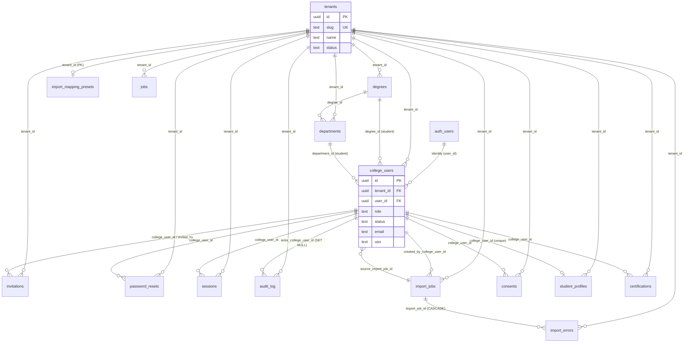

# Database Documentation

> Source of truth: `supabase/migrations/*.sql` (7 migrations). This document
> describes the schema exactly as those migrations build it. Column types,
> constraints, and RLS below are transcribed from the DDL, not summarized.

- Engine: PostgreSQL (via Supabase). All application tables live in the
  `public` schema. `auth.users` is Supabase/GoTrue-managed and referenced but
  never written by `app_user`.
- Extensions: `pg_trgm` (trigram search on student name/email/USN).
- The application connects as **`app_user`**, a non-owner role, so every
  `FORCE ROW LEVEL SECURITY` policy applies to it. See [security.md](security.md).

## Migration history

| Migration | Adds |
|---|---|
| `20260723000001_tenancy_foundation` | `tenants`, `college_users`, the RLS pattern, the `app_user` role |
| `20260723123124_auth_invitations` | `tenants.slug`, `college_users.email/usn`, `invitations`, `password_resets`, `sessions`, `rate_limit_hits` |
| `20260723140416_college_onboarding` | `tenants` profile columns, `college_users.name`, `degrees`, `departments`, `audit_log`, `find_auth_user_id_by_email()` |
| `20260723161102_student_import` | `import_mapping_presets`, `import_jobs`, `import_errors`, `jobs`, `claim_next_job()`, `college_users` academic columns |
| `20260724021502_student_experience` | `consents`, `student_profiles`, `certifications` |
| `20260724035516_student_administration` | `pg_trgm`, `deactivated` status, trigram indexes on `college_users` |
| `20260724222028_platform_dashboard_stats` | `get_student_counts_by_tenant()` |

## Entity-Relationship Diagram



> `import_jobs` ↔ `college_users` is a two-way reference (a job is *created
> by* a college_user; a student college_user records its *source import job*).
> This is a legitimate cycle, resolved at delete time by nulling
> `college_users.source_import_job_id` first (see the data-cleanup notes in
> the repo history).

## Conventions shared by every table

- **Primary key:** `id uuid primary key default gen_random_uuid()` (except
  `import_mapping_presets`, whose PK *is* `tenant_id`, and `rate_limit_hits`,
  a composite PK).
- **Timestamps:** `created_at`/`updated_at timestamptz not null default now()`
  where present. `updated_at` is set by application code, not a DB trigger
  (this project has zero trigger precedent).
- **Tenant-scoped tables** all carry `tenant_id uuid not null references
  public.tenants(id)`, `ENABLE` + `FORCE ROW LEVEL SECURITY`, and the
  identical policy:

  ```sql
  create policy tenant_isolation on public.<table>
    for all
    using (tenant_id = nullif(current_setting('app.tenant_id', true), '')::uuid)
    with check (tenant_id = nullif(current_setting('app.tenant_id', true), '')::uuid);
  ```

  Below, "**RLS:** standard `tenant_isolation`" means exactly this. Only
  deviations (grants, non-tenant tables) are spelled out.

---

# Tenant-scoped tables

## `college_users`

**Purpose.** One row per person per college — the join between a GoTrue
identity (`auth.users`) and a tenant, carrying role, status, contact fields,
and (for students) academic fields. The same person can hold rows in multiple
tenants (one login across colleges, spec 6.5).

**Columns**

| Column | Type | Notes |
|---|---|---|
| `id` | uuid PK | |
| `tenant_id` | uuid NOT NULL | → `tenants(id)` |
| `user_id` | uuid NOT NULL | → `auth.users(id)` (GoTrue identity) |
| `role` | text NOT NULL | `super_admin` \| `college_admin` \| `student` |
| `status` | text NOT NULL default `invited` | `invited` \| `active` \| `deactivated` |
| `email` | text NOT NULL | denormalized from GoTrue (app_user has no `auth` grants) |
| `usn` | text | university seat number; students only in practice |
| `name` | text | nullable (populated by college-creation / import) |
| `degree_id` | uuid | → `degrees(id)`, students only |
| `department_id` | uuid | → `departments(id)`, students only |
| `graduation_year` | int | students only |
| `source_import_job_id` | uuid | → `import_jobs(id)`, set when created by bulk import |
| `created_at`, `updated_at` | timestamptz NOT NULL | |

**Constraints**

- `unique (tenant_id, user_id)` — one row per identity per college.
- `college_users_status_check`: `status in ('invited','active','deactivated')`.
- `college_users_student_fields_check`: `role = 'student' OR (degree_id IS
  NULL AND department_id IS NULL AND graduation_year IS NULL)` — academic
  fields are structurally forbidden on non-students.

**Foreign keys.** `tenant_id → tenants`, `user_id → auth.users`,
`degree_id → degrees`, `department_id → departments`,
`source_import_job_id → import_jobs`.

**Indexes**

- `college_users_tenant_id_idx (tenant_id)`
- `college_users_tenant_email_idx unique (tenant_id, lower(email))`
- `college_users_tenant_usn_idx unique (tenant_id, usn) where usn is not null`
- `college_users_name_trgm_idx` GIN `(name gin_trgm_ops)` — search
- `college_users_email_trgm_idx` GIN `(email gin_trgm_ops)` — search
- `college_users_usn_trgm_idx` GIN `(usn gin_trgm_ops)` — search

**Relationships.** Parent of `student_profiles` (1:1), `certifications`,
`consents`, `invitations`, `password_resets`, `sessions`, and `audit_log`
(actor). Belongs to a `tenant`, a `degree`, a `department`.

**RLS:** standard `tenant_isolation`. Grants: `select, insert, update, delete`.

**How it's used.** Login resolves email/USN → this row (must be `active`).
`resolveSession` reads role from the session's `college_user`. Admin student
management searches it via the trigram indexes; deactivation flips `status`.

**Example record**

```json
{
  "id": "4c38ed3e-f48e-40fd-b80b-7dc3073062c5",
  "tenant_id": "20b6da13-b670-445a-b2d1-14ebd4edf1db",
  "user_id": "b1f0…",
  "role": "student",
  "status": "active",
  "email": "asha.rao@example.com",
  "usn": "1BI21CS001",
  "name": "Asha Rao",
  "degree_id": "0883fa63-…",
  "department_id": "3a88ad94-…",
  "graduation_year": 2027,
  "source_import_job_id": "6b06ae37-…"
}
```

## `invitations`

**Purpose.** A single-use, hashed, expiring activation token for a
newly-provisioned `college_users` row. The raw token is emailed (inside a
compound token); only its SHA-256 hash is stored.

**Columns:** `id`, `tenant_id` NOT NULL, `college_user_id` NOT NULL →
`college_users`, `token_hash text NOT NULL UNIQUE`, `invited_by uuid →
college_users` (nullable — the super-admin bootstrap has no human inviter),
`expires_at timestamptz NOT NULL`, `consumed_at`, `revoked_at`,
`created_at`, `updated_at`.

**Constraints/FKs:** `token_hash` unique; FKs to `tenants` and to
`college_users` twice (`college_user_id`, `invited_by`). **Indexes:**
`invitations_tenant_id_idx`. **RLS:** standard. Grants: all four.

**How it's used.** `provisionInvitation` inserts it; `/auth/activate` looks up
the active (unconsumed, unrevoked, unexpired) row by `token_hash`, verifies
its `tenant_id` matches the token prefix, then consumes it. Reissuing an
invitation revokes prior open ones.

**Example:** `{ "token_hash": "9f…(hex)", "invited_by": "…", "expires_at":
"2026-08-01T…Z", "consumed_at": null, "revoked_at": null }`.

## `password_resets`

**Purpose.** Same shape and lifecycle as `invitations`, for a
password-reset link (1-hour expiry, spec 10.5).

**Columns:** `id`, `tenant_id`, `college_user_id → college_users`,
`token_hash NOT NULL UNIQUE`, `expires_at NOT NULL`, `consumed_at`,
`revoked_at`, `created_at`, `updated_at`. **Index:**
`password_resets_tenant_id_idx`. **RLS:** standard. Grants: all four.

**How it's used.** `/auth/reset/request` revokes open resets for the user then
inserts a fresh one; `/auth/reset/complete` consumes it and **revokes all of
the user's sessions**. Admin-triggered reset (`/students/:id/trigger-reset`)
uses the same table.

## `sessions`

**Purpose.** The API's own first-party session (ADR 0002) — not a GoTrue JWT.
The browser's bearer token is `"<tenant_id>.<rawToken>"`; only
`sha256(rawToken)` is stored here.

**Columns:** `id`, `tenant_id`, `college_user_id → college_users`,
`token_hash NOT NULL UNIQUE`, `created_at`, `last_used_at NOT NULL default
now()`, `expires_at NOT NULL`, `revoked_at`. **Index:**
`sessions_tenant_id_idx`. **RLS:** standard. Grants: all four.

**How it's used.** `/auth/login` inserts (24h expiry). `resolveSession` reads
by `token_hash` under the token's tenant, checks `revoked_at IS NULL` and
`expires_at > now`, then bumps `last_used_at`. Password reset and deactivation
set `revoked_at`.

## `degrees`

**Purpose.** A tenant's degree programmes (e.g. "B.Tech", "M.Tech").

**Columns:** `id`, `tenant_id`, `name text NOT NULL`, `created_at`,
`updated_at`. **Indexes:** `degrees_tenant_name_idx unique (tenant_id,
lower(name))`, `degrees_tenant_id_idx`. **RLS:** standard. Grants: all four.

**Relationships.** Parent of `departments` (and, indirectly, of student
`college_users` via `degree_id`). Deleting a degree with departments still
attached is blocked by the FK (RESTRICT); the API translates the resulting
`23503` error to HTTP 409.

## `departments`

**Purpose.** Departments/branches under a degree (e.g. "Computer Science and
Engineering" under "B.Tech").

**Columns:** `id`, `tenant_id`, `degree_id uuid NOT NULL → degrees`, `name
NOT NULL`, `created_at`, `updated_at`. **Indexes:**
`departments_tenant_degree_name_idx unique (tenant_id, degree_id,
lower(name))`, `departments_tenant_id_idx`. **RLS:** standard. Grants: all four.

**How it's used.** Student import/invite resolves a department **name** →
`department_id`, and always derives `degree_id` from it server-side (never
accepts `degree_id` as separate client input).

## `audit_log`

**Purpose.** An **immutable** record of administrative actions (actor, tenant,
action, target, IP, time) — spec 12.6 / 14.1 #11. See ADR 0008.

**Columns**

| Column | Type | Notes |
|---|---|---|
| `id` | uuid PK | |
| `tenant_id` | uuid NOT NULL | the tenant the action was performed *against* |
| `actor_college_user_id` | uuid | → `college_users` **ON DELETE SET NULL** |
| `action` | text NOT NULL | e.g. `college.create`, `student.deactivate` (plain text, not an enum) |
| `target_type` | text NOT NULL | e.g. `tenant`, `college_user` |
| `target_id` | uuid | |
| `ip_address` | inet | |
| `created_at` | timestamptz NOT NULL | |

**Index:** `audit_log_tenant_id_idx`. **RLS:** standard policy, but the
**grant is narrower on purpose: `select, insert` only** — no `update`/`delete`,
so Postgres itself forbids editing or erasing history even from an app bug.
`actor_college_user_id` may point into a *different* tenant (a super_admin on
the platform tenant acting on a new college).

**How it's used.** `writeAuditLog()` is called inside the same `withTenant`
transaction as the action it records (atomic — ADR 0008). `/audit-log` reads
it, newest first, paginated.

## `import_mapping_presets`

**Purpose.** Remembers a tenant's last confirmed column mapping so a repeat
upload pre-fills automatically.

**Columns:** `tenant_id uuid PRIMARY KEY → tenants`, `column_mapping jsonb
NOT NULL default '{}'`, `updated_at`. (The PK *is* `tenant_id` — one preset
per tenant.) **RLS:** standard. Grants: all four.

**How it's used.** On upload, the saved preset is merged over the auto-guessed
mapping (preset wins only if the column still exists in the new file).
Confirming a mapping via `PATCH /import-jobs/:id/mapping` silently upserts it.

## `import_jobs`

**Purpose.** One row per uploaded roster file, tracked through the six-phase
bulk-import workflow.

**Columns**

| Column | Type | Notes |
|---|---|---|
| `id` | uuid PK | |
| `tenant_id` | uuid NOT NULL | |
| `created_by_college_user_id` | uuid NOT NULL | → `college_users` |
| `original_filename` | text NOT NULL | |
| `file_path` | text NOT NULL | path in `college-imports` bucket |
| `file_sha256` | text NOT NULL | informational duplicate-warning only, never a uniqueness constraint |
| `column_mapping` | jsonb NOT NULL default `{}` | target field → source header |
| `phase` | text NOT NULL default `uploaded` | `uploaded`→`mapped`→`validated`→`committing`→`committed` \| `failed` |
| `row_count`, `valid_count`, `invalid_count`, `create_count`, `update_count` | int | set at validation |
| `committed_row_count` | int | set when commit finishes |
| `committed_at` | timestamptz | |
| `error_message` | text | set on `failed` |
| `created_at`, `updated_at` | timestamptz NOT NULL | |

**Constraint:** `phase in ('uploaded','mapped','validated','committing',
'committed','failed')`. **Index:** `import_jobs_tenant_id_idx`. **RLS:**
standard. Grants: all four.

## `import_errors`

**Purpose.** Per-row rejection reasons — the source for the downloadable error
CSV.

**Columns:** `id`, `tenant_id`, `import_job_id uuid NOT NULL → import_jobs
ON DELETE CASCADE`, `row_number int NOT NULL`, `raw_row jsonb NOT NULL`,
`error_reason text NOT NULL` (multiple issues joined with `"; "`),
`created_at`. **Index:** `import_errors_tenant_job_idx (tenant_id,
import_job_id)`. **RLS:** standard. Grants: `select, insert, delete` (no
`update` — errors are replaced via delete+insert on each validation).

## `jobs`

**Purpose.** A generic Postgres-backed background job queue (spec 9.1). No
Redis. Drives `apps/worker`.

**Columns**

| Column | Type | Notes |
|---|---|---|
| `id` | uuid PK | |
| `tenant_id` | uuid NOT NULL | |
| `type` | text NOT NULL | `import.commit` \| `invitations.send` |
| `payload` | jsonb NOT NULL default `{}` | e.g. `{ importJobId, offset }` |
| `status` | text NOT NULL default `queued` | `queued` \| `running` \| `succeeded` \| `failed` |
| `attempts` | int NOT NULL default 0 | |
| `max_attempts` | int NOT NULL default 5 | |
| `run_after` | timestamptz NOT NULL default now() | claim/backoff scheduling |
| `last_error` | text | |
| `idempotency_key` | text NOT NULL | the `import_jobs.id` — makes re-enqueue a no-op |
| `created_at`, `updated_at` | timestamptz NOT NULL | |

**Constraints:** `type` and `status` checks; `unique (tenant_id, type,
idempotency_key)`. **Index:** partial `jobs_poll_idx (status, run_after)
where status = 'queued'` (keeps the poll query cheap). **RLS:** standard
policy for ordinary tenant reads. The worker's cross-tenant claim goes
through `claim_next_job()` (below), *not* this policy. Grants: all four.

## `consents`

**Purpose.** One row per (student, activation) capturing DPDP-style consent at
first login, never overwritten.

**Columns:** `id`, `tenant_id`, `college_user_id → college_users`,
`policy_version text NOT NULL` (stamped server-side, `CURRENT_POLICY_VERSION
= "1.0"`), `consented_at`, `created_at`. **Indexes:**
`consents_college_user_id_idx`, `consents_tenant_id_idx`. **RLS:** standard.
Grants: `select, insert` only (immutable). Written atomically with
`markCollegeUserActive` during student activation.

## `student_profiles`

**Purpose.** Self-authored student profile content — 1:1 with `college_users`.

**Columns:** `id`, `tenant_id`, `college_user_id uuid NOT NULL **UNIQUE** →
college_users`, `avatar_path`, `linkedin_url`, `github_url`, `resume_path`,
`bio`, `skills`, `interests`, `achievements`, `created_at`, `updated_at`.
**Index:** `student_profiles_tenant_id_idx`. **RLS:** standard. Grants:
`select, insert, update` (no delete — a profile is upserted, never removed).
"Profile complete" (`avatar` + `linkedin` present) is computed by the caller,
never stored.

## `certifications`

**Purpose.** Repeatable student certifications (workshops/internships/courses).

**Columns:** `id`, `tenant_id`, `college_user_id → college_users`, `name NOT
NULL`, `type text NOT NULL` (`workshop`|`internship`|`course`),
`issuing_organisation NOT NULL`, `date date`, `certificate_url`,
`created_at`, `updated_at`. **Indexes:** `certifications_college_user_id_idx`,
`certifications_tenant_id_idx`. **RLS:** standard. Grants: all four.
Ownership (one student can't touch another's rows in the same tenant) is
enforced at the application layer (`where college_user_id = caller`), since
RLS only isolates *tenants*.

---

# Non-tenant-scoped tables (no RLS)

## `tenants`

**Purpose.** One row per college. This table *is* the tenant, so it has no
`tenant_id` and **no RLS** — it's queried directly against the plain pool.

**Columns:** `id uuid PK`, `name text NOT NULL`, `slug text NOT NULL UNIQUE`,
`state`, `city`, `status text NOT NULL default 'provisioning'`
(`provisioning`|`active`|`suspended`), `logo_path`, `banner_path`,
`description`, `contact_email`, `contact_phone`, `created_at`, `updated_at`.

**Constraints:** `slug` unique; `tenants_status_check`. **Grants:** `select,
insert, update, delete` to `app_user` — inserting a new tenant (creating a
college) needs no special privilege, which is why `POST /colleges` doesn't
require the service-role key (ADR 0007). The sentinel `platform` tenant
(slug `platform`) anchors super_admin sessions and is created idempotently by
code, not a migration.

**Example:** `{ "slug": "gmit", "name": "GMIT", "status": "active", "city":
"Davangere", "state": "Karnataka", "logo_path": "…/logo.jpg" }`.

## `rate_limit_hits`

**Purpose.** Fixed-window rate-limit counters — operational bookkeeping, not
business data, so **no `tenant_id`, no RLS** (ADR 0004).

**Columns:** `bucket text NOT NULL`, `window_start timestamptz NOT NULL`,
`hit_count int NOT NULL default 1`, **PK `(bucket, window_start)`**. **Grants:**
all four. `bucket` is an app-defined key like `login:<ip>`. Incremented with a
single upsert (`ON CONFLICT … hit_count + 1`) per rate-limited request.

## `auth.users` (external, GoTrue-managed)

Not created by our migrations. `college_users.user_id` references it. It holds
the identity + password hash. `app_user` has **no grants** on the `auth`
schema; the only reads of it happen through the `find_auth_user_id_by_email`
`SECURITY DEFINER` function, and all writes go through GoTrue's Admin API
(service-role) in `apps/api`.

---

# SQL functions

All three are `SECURITY DEFINER` — they run as the function owner (a
privileged role that bypasses RLS), granted `EXECUTE` to `app_user`. Each
exists because its query is inherently cross-tenant or cross-schema, and each
is scoped to a single, minimal purpose rather than being a broad bypass. See
[security.md](security.md#3-security-definer-functions).

## `find_auth_user_id_by_email(p_email text) → uuid`

*(college_onboarding migration)*

```sql
create or replace function public.find_auth_user_id_by_email(p_email text)
returns uuid language sql security definer set search_path = auth, public
as $$ select id from auth.users where lower(email) = lower(p_email) limit 1; $$;
```

**Why.** A person can hold one login across colleges (spec 6.5). When
inviting them into a second college, GoTrue's `createUser` fails with
`email_exists` and its Admin API has no email→id lookup. This exposes exactly
one column (`id`) for exactly that case, so `app_user` never needs (and never
gets) grants on the fragile `auth` schema.

## `claim_next_job(p_job_types text[]) → jobs`

*(student_import migration)*

```sql
select * into claimed from public.jobs
where status = 'queued' and run_after <= now() and type = any(p_job_types)
order by created_at limit 1 for update skip locked;
-- then: update … set status='running', attempts = attempts + 1 … returning *
```

**Why.** The worker's "claim the next queued job" is cross-tenant by
definition — before a job is claimed there is no tenant to scope to, so the
standard RLS policy would return zero rows forever. `FOR UPDATE SKIP LOCKED`
lets multiple workers claim safely. Returns exactly one row; a null `id`
column means nothing was available. **Every subsequent write the worker makes
still goes through `withTenant`.**

## `get_student_counts_by_tenant() → table(tenant_id, total_students, active_students)`

*(platform_dashboard_stats migration)*

```sql
select tenant_id, count(*) as total_students,
       count(*) filter (where status = 'active') as active_students
from public.college_users where role = 'student' group by tenant_id;
```

**Why.** The super_admin platform dashboard aggregates student counts across
**all** tenants at once — `college_users` is FORCE RLS, so a plain query
returns nothing. `GET /colleges` left-joins this against `tenants` (which has
no RLS) on the plain pool. Mirrors the `claim_next_job` precedent exactly.

## Related docs

- **[architecture.md](architecture.md)** — how these tables fit the system
- **[security.md](security.md)** — RLS, `SECURITY DEFINER`, grants in depth
- **[adr/0001](adr/0001-multi-tenant-isolation-shared-db-rls.md)** — why shared-DB + RLS
