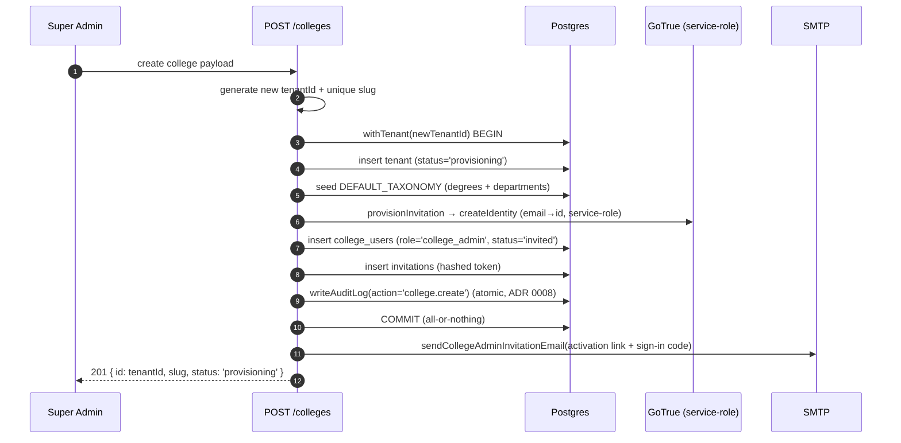
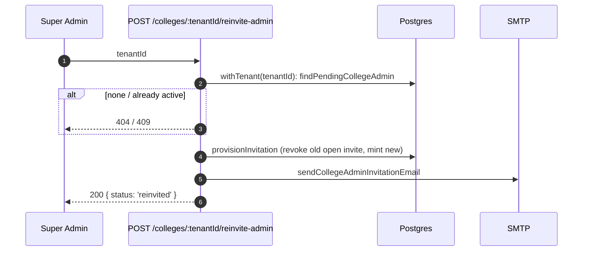
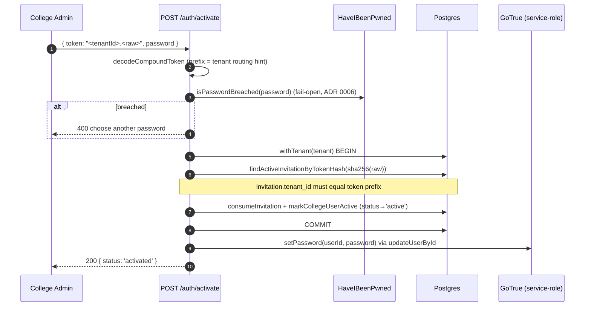
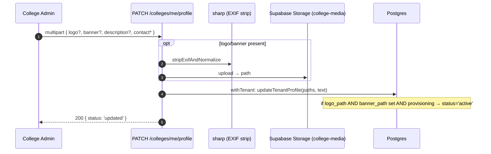
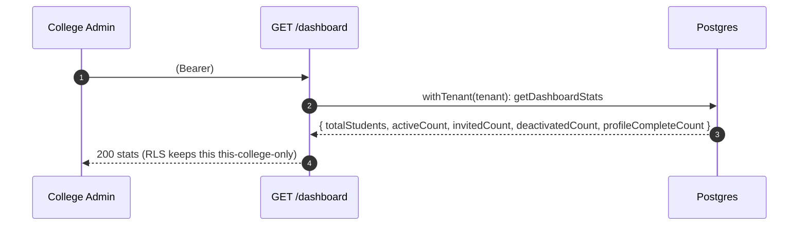
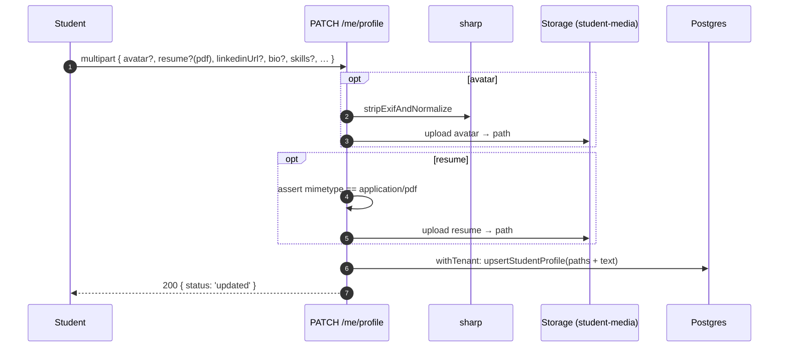
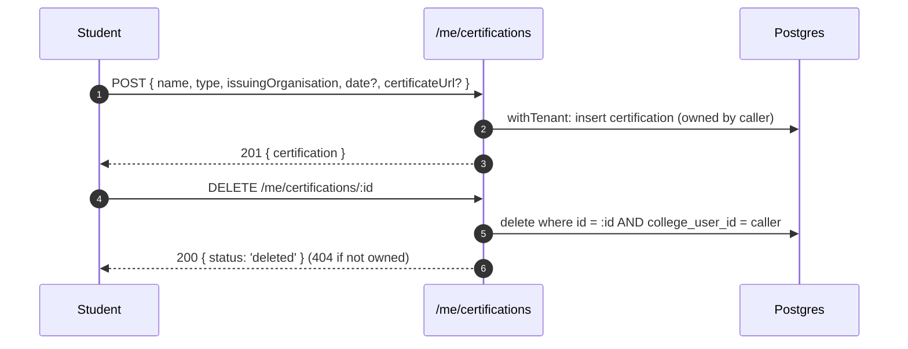

# Workflow Documentation

> Step-by-step flows for every Phase 1 workflow, traced to the actual
> endpoints and worker code. Endpoint paths, phases, and side effects match
> `apps/api/src/routes/*` and `apps/worker/src/jobs/*`.

**Legend.** "under `withTenant(T)`" = executed inside a transaction scoped to
tenant `T` with RLS enforced. All authenticated requests carry
`Authorization: Bearer "<tenantId>.<rawToken>"` and pass through
`resolveSession` → `requirePermission` before the handler runs.

---

## Shared: Login (all roles)

`POST /auth/login` — `{ tenantSlug, emailOrUsn, password }`. Enumeration-
resistant: unknown tenant, unknown user, wrong password, and non-active status
all return the identical `401 invalid credentials`.

```mermaid
sequenceDiagram
  autonumber
  participant U as User (browser)
  participant API as POST /auth/login
  participant DB as Postgres (app_user)
  participant GT as GoTrue (anon key)

  U->>API: { tenantSlug, emailOrUsn, password }
  API->>DB: findTenantBySlug(slug) (plain pool; tenants has no RLS)
  alt tenant missing
    API-->>U: 401 invalid credentials
  end
  API->>DB: withTenant(tenant): find by email or USN
  alt not found OR status != 'active'
    API-->>U: 401 invalid credentials
  end
  API->>GT: verifyPassword(email, password) → signInWithPassword
  alt wrong password
    API-->>U: 401 invalid credentials
  end
  API->>DB: withTenant(tenant): createSession(sha256(rawToken), +24h)
  API-->>U: 200 { token: "<tenantId>.<rawToken>" }
  U->>API: GET /auth/session (Bearer token)
  API-->>U: { role, tenantSlug, email, name } → SPA routes by role
```

Rate limited to 10/15min per `login:<ip>` bucket.

---

## Super Admin

Super admins are anchored to the sentinel `platform` tenant (slug `platform`,
ADR 0007). The first one is seeded by `scripts/bootstrapSuperAdmin.ts` (no
HTTP route), then activates through the ordinary `/auth/activate` flow.

### Create College

`POST /colleges` — `{ name, city, state, adminName, adminEmail }`, gated on
`college.create`. One atomic transaction creates the tenant, seeds the default
degree/department taxonomy, provisions the college_admin invitation, and writes
the audit log; then it emails the admin.



The response `slug` (College ID) and `id` (Tenant ID) are surfaced in the UI —
the admin needs the College ID to log in; the Tenant ID is needed to resend the
activation later. **No service-role key is required for the tenant/college_user
writes** (they go through `app_user`); the only service-role call is GoTrue
identity creation (ADR 0007).

### Invite College Admin

Two paths, both gated on `collegeAdmin.invite` (held by super_admin *and*
college_admin, per spec 7.3):

- **Fresh admin during college creation** — happens inside `POST /colleges`
  above.
- **Resend a stuck/expired invite** — `POST /colleges/:tenantId/reinvite-admin`
  finds the pending admin for that tenant and re-provisions a fresh invitation
  (revoking the old one), emailing again. 409 if the admin is already active.



*(A standalone `POST /invitations` with `role: 'college_admin'` also exists,
used to add a second admin to an existing college.)*

---

## College Admin

### Activate account

`POST /auth/activate` — `{ token, password }` (no consent for admins). Consumes
the invitation and sets the password. Runs the breached-password check first.



If the password step or a missing invite fails, the transaction rolls back and
the single-use token stays valid for a retry.

### Complete college profile

`PATCH /colleges/me/profile` (multipart, gated on `college.editProfile`).
Uploads logo/banner (EXIF-stripped) and profile text. When **both** logo and
banner are present, `updateTenantProfile` flips the tenant `provisioning →
active` in the same statement — the automatic activation gate (no separate
"finish setup" endpoint).



### Dashboard

`GET /dashboard` (gated on `dashboard.view`, scoped to the admin's own tenant).
Returns aggregate student counts computed under RLS.



### Import students (six-phase workflow)

The synchronous phases (upload → mapping → validate) happen in the request;
commit and invitation-send are handed to the worker.

```mermaid
sequenceDiagram
  autonumber
  participant CA as College Admin
  participant API as /import-jobs
  participant ST as Storage (college-imports)
  participant DB as Postgres
  participant W as Worker

  CA->>API: POST /import-jobs (file .csv/.xlsx)
  API->>ST: upload raw file
  API->>DB: parse headers, merge saved preset over auto-guess, create import_job (phase='uploaded')
  API-->>CA: 201 { id, columnMapping, headers, rowCount, duplicateOfJobIds }

  CA->>API: PATCH /import-jobs/:id/mapping { columnMapping }
  API->>DB: setImportJobMapping + upsert preset (phase→'mapped')
  API-->>CA: 200 { status: 'mapped' }

  CA->>API: POST /import-jobs/:id/validate
  API->>ST: download file
  API->>DB: validateImportRows(ctx); replaceImportErrors; store counts (phase→'validated')
  API-->>CA: 200 { validCount, invalidCount, createCount, updateCount }
  opt invalidCount > 0
    CA->>API: GET /import-jobs/:id/errors.csv → download rejected rows + reasons
  end

  CA->>API: POST /import-jobs/:id/commit
  API->>DB: enqueueJob('import.commit', idempotencyKey=jobId) — 409 if not validated
  API-->>CA: 202 { status: 'queued' }
  Note over W,DB: worker processes commit (see Background Worker below), phase→'committed'

  CA->>API: POST /import-jobs/:id/send-invitations { expectedCount }
  API->>DB: countPendingInvitations; 409 on drift; else enqueueJob('invitations.send')
  API-->>CA: 202 { status: 'queued', recipientCount }
```

Notes:
- **Commit and import are separate from inviting** — a completed commit creates
  accounts (`status='invited'`) but sends **no** emails until `send-invitations`.
- `expectedCount` drift protection: if pending recipients changed since the
  admin last reviewed, the API returns 409 with the real `actualCount`.

### Student onboarding (from the admin's side)

Onboarding is: (1) accounts exist after commit, (2) `send-invitations` emails
each student a compound activation link (throttled by the worker), (3) the
student activates. Single-student onboarding uses `POST /invitations` with
`role: 'student'` (department name → `department_id`, `degree_id` derived,
graduation-year sanity-checked), which emails immediately.

---

## Student

### Receive invitation

The worker's `invitations.send` job mints a per-student invitation token and
emails a personalized activation link (name, USN, department, batch) to
`{WEB_APP_URL}/activate?token=<tenantId>.<raw>`. Locally these land in Mailpit
(`http://127.0.0.1:54324`), not a real inbox.

### Activate account (with consent)

Same `POST /auth/activate` as admins, **plus** a required consent checkbox
(students only). Consent is recorded atomically with activation; omitting it
rolls the whole transaction back so the token survives for a retry.

```mermaid
sequenceDiagram
  autonumber
  participant S as Student
  participant API as POST /auth/activate
  participant DB as Postgres
  participant GT as GoTrue
  participant Mail as SMTP
  S->>API: { token, password, consentAccepted: true }
  API->>API: decode token; breached-password check
  API->>DB: withTenant BEGIN → find + consume invitation
  alt role='student' AND consentAccepted != true
    API-->>S: 400 consent required (transaction rolled back, token reusable)
  end
  API->>DB: markCollegeUserActive + recordConsent(policy_version='1.0')
  API->>DB: COMMIT
  API->>GT: setPassword
  API->>Mail: sendStudentActivationConfirmedEmail (link to /profile)
  API-->>S: 200 { status: 'activated' }
```

### Login → Complete profile → Upload resume

Profile edits (including résumé and avatar) are one multipart call,
`PATCH /me/profile`, gated on `profile.editOwn`. Avatar is EXIF-stripped; the
résumé must be a real `application/pdf`. "Profile complete" (avatar + LinkedIn
present) is computed, never stored.



`GET /me/profile` returns the profile plus signed URLs (avatar/résumé) minted
fresh on read, plus the certifications list and computed `profileComplete`.

### Manage certifications

`POST /me/certifications`, `PATCH /me/certifications/:id`,
`DELETE /me/certifications/:id` — all gated on `profile.editOwn`, all with an
application-layer `where college_user_id = caller` ownership check (RLS only
isolates tenants, not one student's rows from another's in the same tenant).



---

## Background Worker

`apps/worker` runs one poll loop: claim the next queued job across all tenants
(via `claim_next_job`), dispatch by type, then repeat. Every business write
after the claim goes through `withTenant`.

### Import processing → validation → commit

```mermaid
sequenceDiagram
  autonumber
  participant Loop as pollLoop
  participant DB as Postgres
  participant ST as Storage
  Loop->>DB: claimNextJob(['import.commit','invitations.send']) → SECURITY DEFINER
  alt nothing queued
    Loop->>Loop: sleep POLL_INTERVAL_MS, retry
  end
  Note over Loop: job.type == import.commit
  Loop->>ST: download import file
  Loop->>DB: withTenant: buildValidationContext + validateImportRows (FULL set, re-validated)
  Loop->>DB: withTenant BEGIN: setImportJobPhase('committing')
  loop chunk of IMPORT_COMMIT_CHUNK_SIZE (payload.offset)
    alt create
      Loop->>DB: resolveCollegeUserForInvite (createIdentity + insert college_user, status='invited')
    else update
      Loop->>DB: updateCollegeUserAcademicFields (by USN)
    end
  end
  alt more rows remain
    Loop->>DB: rescheduleJob(offset = offset + chunk) (stays queued; no in-process sleep)
  else final chunk
    Loop->>DB: setImportJobPhase('committed', committedRowCount) + completeJob('succeeded')
    Loop->>Loop: sendImportSummaryEmail (created/updated/skipped, link to /college/import/:id)
  end
```

Key properties: **idempotent** (re-enqueue is a no-op via the unique
constraint), **resumable** (offset persisted; a restart continues), and the
summary email is sent *outside* the commit transaction so an email failure can
never roll back an already-committed import. On error the phase is set to
`failed`, then the loop reschedules with backoff or fails at `max_attempts`.

### Invitation sending

```mermaid
sequenceDiagram
  autonumber
  participant Loop as pollLoop
  participant DB as Postgres
  participant Mail as SMTP
  Note over Loop: job.type == invitations.send
  Loop->>DB: withTenant: listPendingInvitationCandidates(importJobId, CHUNK_SIZE)
  alt none left
    Loop->>DB: completeJob('succeeded')
  else
    loop each candidate
      Loop->>DB: withTenant BEGIN: mintInvitationToken (hashed)
      Loop->>Mail: sendInvitationEmail(personalized activation link)
      Note over Loop,Mail: mint + send in one tx → "has live invite" == "email sent"
    end
    Loop->>DB: rescheduleJob(+ interval to hit INVITATION_SEND_RATE_PER_HOUR)
  end
```

Throttled (e.g. 10 every 3 minutes at defaults) so a 4,000-row import doesn't
blast the mail provider; resumable without offset bookkeeping because a live
invitation existing *is* the "already sent" marker.

---

## Dashboards

### College Dashboard (`GET /dashboard`)

Tenant-scoped student stats (total / active / invited / deactivated /
profile-complete), computed by `getDashboardStats` under `withTenant` — so it's
inherently this-college-only, no cross-tenant leakage possible. Held by
college_admin; the frontend `Dashboard.tsx` additionally restricts the view to
`role === 'college_admin'` so a super_admin landing there sees an access
message rather than empty platform-tenant stats.

### Platform Dashboard (`GET /colleges`)

Platform-wide, gated on `college.viewAll` (super_admin only). Lists **every**
college with per-college student counts, excluding the `platform` sentinel.

```mermaid
sequenceDiagram
  autonumber
  participant SA as Super Admin
  participant API as GET /colleges
  participant DB as Postgres
  SA->>API: (Bearer, college.viewAll)
  API->>DB: pool.query: tenants LEFT JOIN get_student_counts_by_tenant()
  Note over DB: tenants has no RLS; counts via SECURITY DEFINER function; WHERE slug != 'platform'
  DB-->>API: [{ id, slug, name, status, city, state, totalStudents, activeStudents }]
  API-->>SA: 200 { colleges }
```

Summary tiles (total colleges / active / provisioning) are computed
client-side from this one list — no second endpoint.

## Related docs

- **[architecture.md](architecture.md)** — request/session lifecycle, worker design
- **[database.md](database.md)** — the tables these workflows read and write
- **[security.md](security.md)** — the auth, permission, and rate-limit gates
